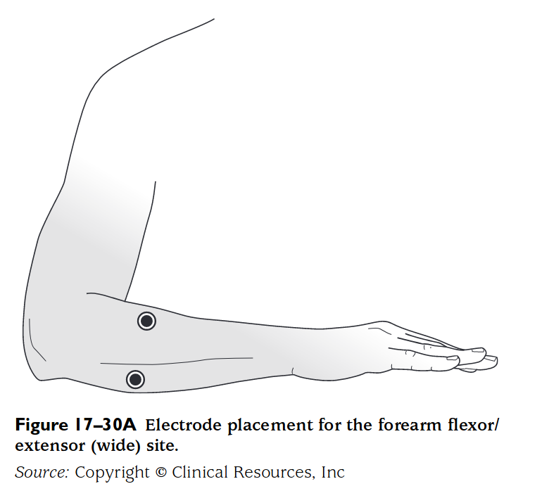
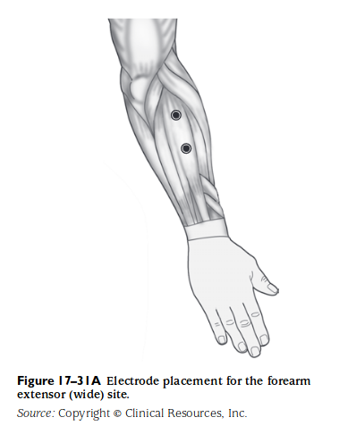
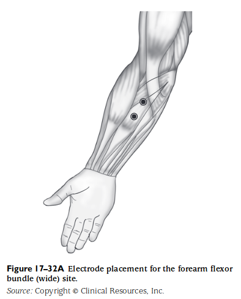

- [[@Cram's introduction to surface electromyography]]
	- ## Flexor/extensor předloktí
		- 
			- [[@Cram's introduction to surface electromyography]]
		- Sleduje obecné pnutí v předloktí
		- Slouží k posouzení pnutí v předloktí za účelem léčby zranění horní končetiny, například z repetitivních činností
		- Umístění
			- Jedna aktivní elektroda je umístěna nad extenzor zápěstí
				- Dorzální strana předloktí
				- Přibližně 5 cm od lokte
				- Nalezneme pohmatem při extenzi zápěstí
			- druhá nad flexor zápěstí
				- Ventrální strana předloktí
				- Přibližně 5 cm od lokte
				- Nalezneme pohmatem při flexi zápěstí
		- Klinické úvahy
			- Hodnoty se mohou měnit v závislosti na činnosti ostatních svalových skupin ruky
			- Velikost pronace/supinace může měnit hodnoty
			- Poloha paže může měnit hodnoty, například při sezení bude jiná než při stání.
	- ## Extenzor zápěstí
		- {:height 494, :width 379}
			- [[@Cram's introduction to surface electromyography]]
		- Měří extenzory zápěstí (primárně extenosor digitorum)
		- Slouží k posouzení extenzorů předloktí za účelem léčby zranění z repetivních činností
		- Umístění
			- Obě aktivní elektrody na extenzor
			- Dorzální strana předloktí
			- cca 5 cm od lokte
			- Zjistíme pohmatem při extenzi zápěstí
				- Elektrody umístíme do středu zvýrazněného shluku cca 3-4 cm od sebe ve směru svalových vláken
			- Široké umístění zařídí snímání extensoru carpi radialis, extensoru carpi ulanris a extensoru digitorum
		- Klinické úvahy
			- Klidové hodnoty mohou být ovlivněny polohou paže, zápěstí a prstů a úrovní pronace a supinace
	- ## Flexor zápěstí
		- 
			- [[@Cram's introduction to surface electromyography]]
		- Měří flexory zápěstí
		- Slouží k posouzení flexorů předloktí za účelem léčby zranění z repetivních činností
		- Umístění
			- Obě aktivní elektrody na flexor
			- Ventrální strana předloktí
			- cca 5 cm od lokte
			- Najdeme pohmatem při flexi zápěstí
			- Elektrody umístíme do středu zvýrazněného shluku cca 3-4 cm od sebe ve směru svalových vláken
		- Klinické úvahy
			- Poloha a podepření ruky, prstů a paže může ovlivnit hodnoty
			- Klidové hodnoty jsou ovlivněné paže, zápěstí a prstů
			- Pronace a supinace mohou ovlivnit měření